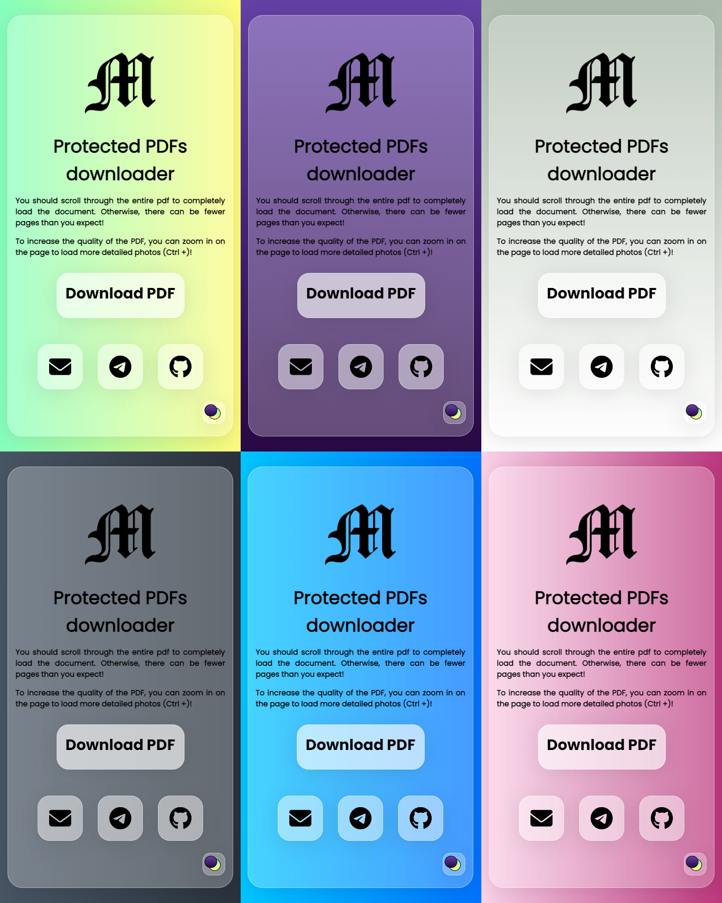

# Protected PDFs downloader

This extension can download protected from downloading PDFs from google drive. Just press the download button!

If this extension helped you, don't forget to star this repository!

## Install extension

Install from Microsoft Edge Addons:
1. Go to the [Extension page in Microsoft Edge Addons](https://microsoftedge.microsoft.com/addons/detail/idjfnnloeipgibchkejkjaahdiccdkmi)
2. Click "Get"
3. Click "Install Extension"

Install this extension manually from github:
1. Clone or download this repository
2. Go to the extension tab in your browser
3. Turn on developer mode on the top right
4. Click "Load unpacked extension"
5. Select the folder with an extension

## Changelog

V1.2.2:
- Minor style improvements

V1.2.1:
- Added effects to download button
- New pink theme
- Minor improvements

V1.2.0: 
- Updated design

V1.1.1:
- Added icons to contact section

V1.1.0:
- increased pdf quality
- added support for pdfs other than A4 format
- added support for pdfs in landscape mode

V1.0.0:
- first public version
## Contact me

Email: [maximax6767@gmail.com](mailto:maximax6767@gmail.com)

Telegram: [@Maximax67](https://t.me/Maximax67)

Github: [Maximax67](https://github.com/Maximax67)
